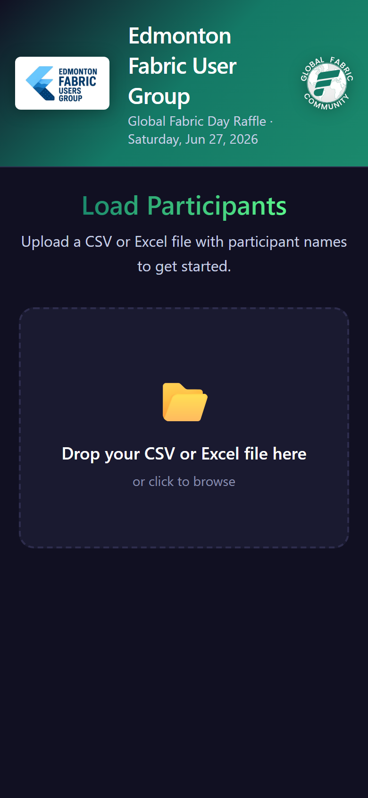
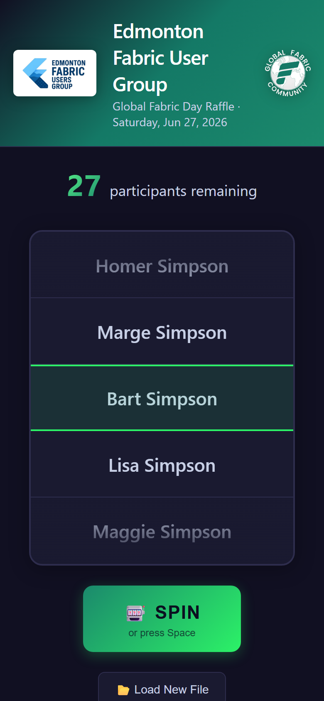
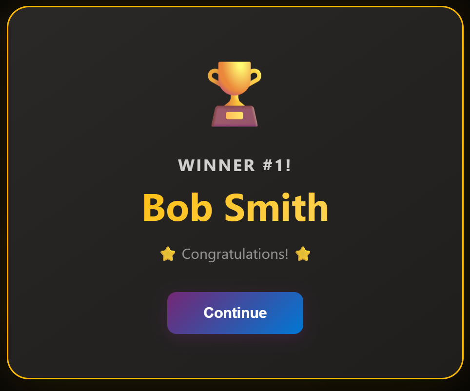

# Edmonton Fabric User Group — Raffle Spinner

A visually appealing slot-machine-style raffle spinner built for the Edmonton Fabric User Group. Upload a CSV or Excel file of participants, pick the name column, and spin to draw winners — complete with sound effects, confetti, and a color scheme inspired by the [Global Fabric Community](https://globalfabric.community/).

<p align="center">
  
  <br />
  
  <br />
  
</p>


---

## Features

- **Slot machine animation** — Names scroll vertically with natural deceleration easing
- **Sound effects** — Procedural tick sounds during spin and a fanfare on winner reveal (Web Audio API, no external files)
- **Confetti celebration** — Multi-burst confetti explosion when a winner is drawn
- **CSV & Excel support** — Upload `.csv`, `.xlsx`, or `.xls` files; pick which column contains names
- **Multi-winner draws** — Previous winners are removed from the pool automatically
- **Winner history sidebar** — Track all drawn winners in order, with one-click CSV export
- **Keyboard shortcuts** — `Space` to spin, `Esc` to dismiss the winner overlay, `R` to reset, `E` to export winners to CSV
- **CSV export of winners** — Download a timestamped `…-winners-YYYY-MM-DD.csv` (Excel-friendly, UTF-8 with BOM) for post-event fulfillment & sponsor reporting
- **Global Fabric Community themed** — Dark navy UI with signature green accents and gold winner highlights
- **Fully client-side** — No backend or server required; runs entirely in the browser

---

## Prerequisites

- [Node.js](https://nodejs.org/) v18 or later (LTS recommended)
- npm (included with Node.js)

---

## Getting Started

### 1. Clone the repo

```bash
git clone https://github.com/<your-org>/edm-fabric-usergroup_raffle-spinner.git
cd edm-fabric-usergroup_raffle-spinner
```

### 2. Install dependencies

```bash
npm install
```

### 3. Start the development server

```bash
npm run dev
```

Vite will print a local URL (default **http://localhost:5173**). Open it in your browser — the app hot-reloads as you edit files.

To stop the dev server, press `Ctrl+C` in the terminal.

### 4. Build for production

```bash
npm run build
```

The optimized output will be in the `dist/` folder. You can preview the production build with:

```bash
npm run preview
```

If you'll be hosting under a sub-path (e.g. GitHub Pages project sites), set `BASE_PATH` when building so asset URLs resolve correctly:

```bash
BASE_PATH=/raffle-spinner/ npm run build      # macOS / Linux
$env:BASE_PATH='/raffle-spinner/'; npm run build  # Windows PowerShell
```

---

## Customizing for Your Event

All event-specific text lives in **three constants** at the top of [`src/App.jsx`](src/App.jsx). Update these for each new event — nothing else needs to change.

```jsx
// src/App.jsx
const EVENT_NAME    = 'Edmonton Fabric User Group';
const EVENT_TAGLINE = 'Global Fabric Day Raffle';
const EVENT_DATE    = '2026-06-27'; // YYYY-MM-DD
```

| Constant | What it controls | Example |
|---|---|---|
| `EVENT_NAME` | Large title in the header | `Edmonton Fabric User Group` |
| `EVENT_TAGLINE` | Short description before the date | `Global Fabric Day Raffle` |
| `EVENT_DATE` | ISO date (`YYYY-MM-DD`). Rendered as `Saturday, Jun 27, 2026` | `2026-06-27` |

The header subtitle is composed as: **`{EVENT_TAGLINE} · {formatted EVENT_DATE}`**.

### Setting up prizes (per draw, no code changes)

Prizes are entered **in the app itself** every time you run a raffle — there is no constant to edit. This keeps the same build reusable across events.

1. Start the app (`npm run dev` for local, or open your deployed URL).
2. Upload your participants CSV/Excel.
3. On the **Configure** screen, click the **🎁 Award specific prizes?** disclosure (it's collapsed by default so simple raffles stay clutter-free).
4. Paste one prize per line, **in the order you want to award them**, for example:

   ```text
   Grand prize: Surface Pro 11
   Xbox Series X
   $100 Microsoft Store gift card
   ```

5. Pick the name column. The app jumps to the spinner with a **"Prize 1 of N"** banner showing the first prize.
6. Each spin advances to the next prize. After the last one, the SPIN button is locked and a **"🎉 All N prizes have been awarded!"** banner appears.

Skip the disclosure entirely for a generic raffle — winners are simply numbered `#1`, `#2`, `#3`, … with no prize labels.

> Tip — running the same prize list at a recurring event? Keep it in a `prizes.txt` file in your event-day folder and paste it into the textarea each time. (A future enhancement could load this from a file; today it's manual.)

### Changing logos

The header shows two logos sourced from `public/`:

- **Left:** `public/edm_fabusergroup.png` — your local user group
- **Right:** `public/global-fabric-community-logo.svg` — links to <https://globalfabric.community/>

Replace either file (keep the same filename) or edit the `` tags in `src/App.jsx` to point at different assets.

### Changing the theme

Color variables live in [`src/index.css`](src/index.css) under `:root` (the `--gfc-*` palette). Backwards-compatible `--fabric-*` aliases mean existing component CSS keeps working when you swap the palette.

---

## Usage

1. **Upload a file** — Drag and drop (or click to browse) a `.csv` or `.xlsx` file containing participant names.
2. **(Optional) Add prize labels** — On the Configure screen, expand the **🎁 Award specific prizes?** section and paste one prize per line. Winners are drawn in that order and each is labelled with the prize they receive. Skip this step for a generic raffle (winners are simply numbered `#1`, `#2`, …). See [Setting up prizes](#setting-up-prizes-per-draw-no-code-changes) for examples.
3. **Select the name column** — If the file has multiple columns, pick the one that contains participant names.
4. **Spin!** — Click the **SPIN** button or press `Space` to draw a winner. When prize mode is on, the next prize is shown above the spinner.
5. **Celebrate** — The winner is revealed with confetti, a fanfare sound, and (if configured) the prize they've won.
6. **Draw again** — Click **Continue** (or press `Escape`), then spin again. Previous winners are automatically removed from the pool.
7. **Wrap up** — Once every prize has been awarded, the SPIN button is replaced with an "All prizes have been awarded!" banner. Click **📥 Export Winners** (or press `E`) to download the winner list as a CSV, then **Reset Raffle** to put participants back in the pool, or **Load New File** to start over.

### Keyboard shortcuts (stage use)

Designed for one-handed presenter use — no clicking needed once the spinner is loaded.

| Key | Action | Available when |
|---|---|---|
| `Space` | Spin the wheel | On the spinner screen, idle, with participants & prizes remaining |
| `Esc` | Dismiss the winner overlay | While the winner card is visible |
| `R` | Reset raffle (returns all winners to the pool) | At least one winner drawn |
| `E` | Export winners to CSV | At least one winner drawn |

Shortcuts are ignored while typing in the prize textarea or column selector, so they won't hijack data entry.

### CSV export format

The **📥 Export Winners** button (and the `E` shortcut) downloads a file named `<event-slug>-winners-<event-date>.csv` with columns:

| `#` | `Name` | `Prize` | `Exported at` |
|---|---|---|---|
| 1 | Svetlana Soldatov | Grand prize: Surface Pro 11 | 2026-06-27T19:30:00.000Z |
| 2 | Bennet Steem | Xbox Series X | 2026-06-27T19:34:12.000Z |

The file is UTF-8 with a BOM so Excel renders accented names correctly, and embedded commas/quotes/newlines in names are properly escaped.

A sample file is included at `public/test-participants.csv` for testing.

---

## Project Structure

```
raffle-spinner/
├── public/
│   ├── edm_fabusergroup.png       # Edmonton Fabric User Group logo
│   └── test-participants.csv      # Sample participant list for testing
├── src/
│   ├── components/
│   │   ├── ColumnSelector.jsx     # Dropdown to pick the name column
│   │   ├── FileUpload.jsx         # Drag-and-drop file upload zone
│   │   ├── SlotMachine.jsx        # Core slot machine animation
│   │   ├── WinnerDisplay.jsx      # Winner celebration overlay with confetti
│   │   └── WinnerHistory.jsx      # Sidebar listing all drawn winners
│   ├── hooks/
│   │   ├── useAudio.js            # Web Audio API sound effects (tick, fanfare)
│   │   └── useRaffle.js           # Raffle state management
│   ├── utils/
│   │   └── fileParser.js          # CSV/Excel file parser (PapaParse + read-excel-file)
│   ├── App.jsx                    # Main app shell and layout
│   ├── App.css                    # Fabric-themed component styles
│   ├── index.css                  # Global reset and CSS variables
│   └── main.jsx                   # React entry point
├── package.json
└── vite.config.js
```

---

## Tech Stack

| Technology | Purpose | Documentation |
|---|---|---|
| [React 19](https://react.dev/) | UI framework | [React Docs](https://react.dev/learn) |
| [Vite 8](https://vite.dev/) | Build tool & dev server | [Vite Guide](https://vite.dev/guide/) |
| [Framer Motion](https://www.framer.com/motion/) | Animation library | [Framer Motion Docs](https://www.framer.com/motion/introduction/) |
| [PapaParse](https://www.papaparse.com/) | CSV file parsing | [PapaParse Docs](https://www.papaparse.com/docs) |
| [read-excel-file](https://gitlab.com/nicedoc/read-excel-file) | Excel (.xlsx) file parsing | [read-excel-file README](https://gitlab.com/nicedoc/read-excel-file#readme) |
| [canvas-confetti](https://github.com/catdad/canvas-confetti) | Confetti particle effects | [canvas-confetti README](https://github.com/catdad/canvas-confetti#readme) |
| [Web Audio API](https://developer.mozilla.org/en-US/docs/Web/API/Web_Audio_API) | Procedural sound effects | [MDN Web Audio API](https://developer.mozilla.org/en-US/docs/Web/API/Web_Audio_API/Using_Web_Audio_API) |

---

## Input File Format

The app accepts **CSV** (`.csv`) and **Excel** (`.xlsx`, `.xls`) files. The file should have a header row. Example:

| Name | Email | Company |
|---|---|---|
| Alice Johnson | alice@example.com | Contoso |
| Bob Smith | bob@example.com | Fabrikam |
| Carol Williams | carol@example.com | Northwind |

After uploading, you'll be prompted to select which column contains the participant names.

---

## Keyboard Shortcuts

| Key | Action |
|---|---|
| `Space` | Spin the raffle (when ready) |
| `Escape` | Dismiss the winner overlay |

---

## Deploying

Since this is a fully static app with no backend, you can deploy the `dist/` folder to any static hosting service:

- **Azure Static Web Apps** — `npm run build`, then deploy `dist/`
- **GitHub Pages** — Use a GitHub Action to build and deploy
- **Netlify / Vercel** — Connect your repo and set build command to `npm run build` with output directory `dist`

---

## License

MIT
